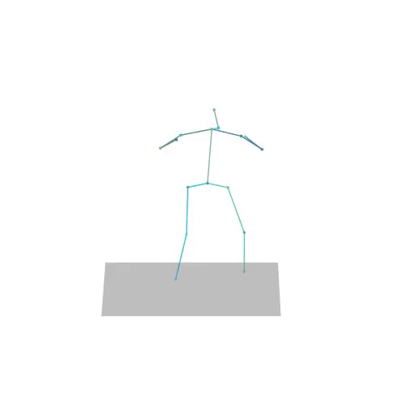
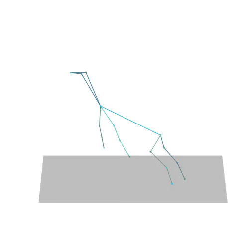
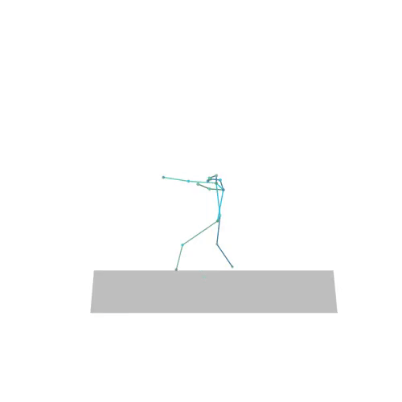

# MAS: Multi-view Ancestral Sampling for 3D motion generation using 2D diffusion 


[](https://arxiv.org/abs/2310.14729) [](https://guytevet.github.io/mas-page/)

The official PyTorch implementation of the paper [**"MAS: Multi-view Ancestral Sampling for 3D motion generation using 2D diffusion"**](https://arxiv.org/abs/2310.14729).


## News

📢 **5/Nov/23** - First release


## Getting started

This code was tested on `Ubuntu 18.04.5 LTS` and requires:

* Python 3.7
* conda3 or miniconda3
* CUDA capable GPU (one is enough)


### 1. Setup environment

Setup conda env:
```shell
conda env create -f environment.yml
conda activate mas
```
<!--If you would like to use text conditioning, you can use CLIP:
pip install git+https://github.com/openai/CLIP.git -->


### 2. Get data

If you would like to to train or evaluate a model, you can download the relevant dataset.
This is not required for using the pretrained models.

Download the zip file `<dataset_name>.zip`, then extract it into `dataset/<dataset_name>/` inside the project directory. Alternatively, you can extract it to some other path and edit `datapath` in `data_loaders/<dataset_name>/config.py` to your custom path.

* [horse.zip](https://drive.google.com/file/d/1VzgxgoNOekZIBnFw_3CQrvl4zmeXwsyi/view?usp=sharing)

* [gymnastics.zip](https://drive.google.com/file/d/1Xj5qKJtzt1A2gmboZD6mD0OYA7BvljTG/view?usp=sharing)

* [nba.zip](https://drive.google.com/file/d/1nT7P1LO0NNUCUF5BF5uE2v__DeLSL94x/view?usp=sharing)

**Note**: NBA dataset is quite large in size so make sure you have enough free space on your machine.

<details>
  <summary><b>3D pose estimations of the NBA dataset</b></summary>

You can download the results of 3D pose estimations by the supervised [MotionBert](https://github.com/Walter0807/MotionBERT) and unsupervised [Elepose](https://github.com/bastianwandt/ElePose) on the 2D NBA dataset. You can later use them for evaluation, visualization, or for your own needs.
Download the zip `<method>_predictions.zip` file and unzip it into `dataset/nba/<method>_predictions/`. You can use an alternative path, and change the hard-coded paths in `eval/evaluate.py` (defined in the beginning of the file).

* Using [Elepose](https://github.com/bastianwandt/ElePose): [elepose_predictions.zip](https://drive.google.com/file/d/1uRfN_HNN28TDQwaNGa7DnCXcguMGstzd/view?usp=sharing)

* Using [MotionBert](https://github.com/Walter0807/MotionBERT): [motionBert_predictions.zip](https://drive.google.com/file/d/1WX0LxEmh5n_GuaPncO_sYdf6KHUfia9L/view?usp=sharing)

</details>


### 3. Download the pretrained models

We supply the pretrained diffusion models for each dataset.
Download the model(s) you wish to use, then unzip them. We suggest to place them in `save/<dataset>/`.

* [horse_diffusion_model.zip](https://drive.google.com/file/d/1F5in7YeUQ2gziTWMN2S_IEq8wuO7d-PD/view?usp=sharing)

* [gymnastics_diffusion_model.zip](https://drive.google.com/file/d/1Nlna5tnOCJhOTwoPZqdmHrefafww1A8m/view?usp=sharing)

* [nba_diffusion_model.zip](https://drive.google.com/file/d/1P5PlFb3cEjhHky0boHWtwc44xkCFZWdM/view?usp=sharing) 


We also supply the VAE model used for evaluation on the NBA dataset.
Download the model, then unzip it. We suggest to place it in `save/evaluator/<dataset>`. 
* [nba_evaluator.zip](https://drive.google.com/file/d/19d3xKx4P-QKh8h5qMI5WgmdKg1JhUufW/view?usp=sharing)


## Motion Generation

Use the diffusion model to generate 2D motions, or use **MAS** to generate 3D motions.

<details>
  <summary><b>General generation arguments</b></summary>

* `--model_path <path/to/checkpoint.pth>` - the checkpoint file from which we load the model. The model's properties are loaded from the `args.json` file that is found in the same directory as the checkpoint file.
* `--num_samples <number of samples>` - number of generated samples (defaults to 10).
* `--device <index>` - CUDA device index (defaults to 0).
* `--seed <seed>` - seed for all random processes (defaults to 0).
* `--motion_length <duration>` - motion duration in seconds (defaults to 6.0).
* `--use_data` - use motion lengths and conditions sampled from the data (recommended, but requires downloading the data).
* `--show_input_motions` - plot the sampled 2D motions to a video file (only when specifying `--use_data`).
* `--output_dir <directory path>` - the path of the output directory. If not specified, will create a directory named `<method_name>_seed_<seed>` in the same directory as the `<model_path>`.
* `--overwrite` - if there already exists a directory with the same path as `<output_dir>`, overwrite the directory with the new results.

Run ```python -m sample.generate -h``` for full details.

</details>

### 2D Motion Generation

```shell
python -m sample.generate --model_path save/nba/nba_diffusion_model/checkpoint_500000.pth
```

**Note**: Make sure that the `args.json` file is in the same directory as the `<model_path>`.


### Use MAS to generate 3D motions

```shell
python -m sample.mas --model_path save/nba/nba_diffusion_model/checkpoint_500000.pth
```

<details>
  <summary><b>MAS arguments</b></summary>

* All of the general generation arguments are available here.
* `--num_views <number of views>` - number of views used for MAS (defaults to 7).

Run ```python -m sample.mas -h``` for full details.

</details>

<details>
  <summary><b>Dynamic view-point sampling</b></summary>

Use MAS with new view angles sampled on each iteration (Appendix C in the paper).

```shell
python -m sample.ablations --model_path save/nba/nba_diffusion_model/checkpoint_500000.pth --ablation_name random_angles
```

</details>

<details>
  <summary><b>Alternative methods</b></summary>

Generate a 3D motion with alternative methods. 
Specify `--ablation_name` to control the type of method to apply. Can be one of [`mas`, `dreamfusion`, `dreamfusion_annealed`, `no_3d_noise`, `prominent_angle`, `prominent_angle_no_3d_noise`, `random_angles`].

```shell
python -m sample.ablations --model_path save/nba/nba_diffusion_model/checkpoint_500000.pth --ablation_name dreamfusion
```
</details>


#### Output
Running one of the 2D or 3D motion generation scripts will get you a new directory `<output_dir>`, which includes:

* `results.npy` file with all conditions and xyz positions of the generated motions.
* `result_<index>.mp4` - a stick figure animation for each generated motion.
3D motions are plotted with a rotating camera, and repeat twice (this is why there is a sharp transition in the middle):

   

You can stop here, or generate an explicit mesh using the following script.

<details>
  <summary><b>Generate a SMPL mesh</b></summary>

For human motions, it is possible to create a SMPL mesh for each frame:

Download dependencies:

```bash
bash prepare/download_smpl_files.sh
```

If the script fails, create `body_models/` directory, then download the zip file [smpl.zip](https://drive.google.com/uc?id=1INYlGA76ak_cKGzvpOV2Pe6RkYTlXTW2) and extract it into the directory you created.

Then run the script:

```shell
python -m visualize.render_mesh --input_path /path/to/mp4/video/result_<index>.mp4 --skeleton_type <type>
```

**This script outputs:**
* `<file_name>_smpl_params.npy` - SMPL parameters (thetas, root translations, vertices and faces)
* `<file_name>_obj/` - A directory with a mesh per frame in `.obj` format.

**Notes:**
* **Important** - Make sure that the results.npy file is in the same directory as the video file.
* The `.obj` can be integrated into Blender/Maya/3DS-MAX and rendered using them.
* This script is running [SMPLify](https://smplify.is.tue.mpg.de/) and needs GPU as well (can be specified with the `--device` flag).
* You have two ways to animate the sequence:
  1. Use the [SMPL add-on](https://smpl.is.tue.mpg.de/index.html) and the theta parameters saved to `<file_name>_smpl_params.npy` (we always use beta=0 and the gender-neutral model).
  1. A more straightforward way is using the mesh data itself. All meshes have the same topology (SMPL), so you just need to keyframe vertex locations. 
     Since the OBJs are not preserving vertex order, we also save this data to the `<file_name>_smpl_params.npy` file for your convenience.

<details>
  <summary><b>Mesh generation arguments</b></summary>

* `--input_path </path/to/mp4/video/result_<index>.mp4` to specify which sample to convert to a mesh.
* `--skeleton_type <type>` to specify the skeleton type of the motion. Can be one of [`nba`, `motionbert`, `elepose`, `gymnastics`].

</details>

</details>

## Train Your Own 2D Motion Diffusion Model

```shell
python -m train.train_mdm --save_dir save/nba/my_nba_diffusion_model --dataset nba
```

<details>
  <summary><b>Training with evaluation</b></summary>

Add evaluation during training using the `--eval_during_training` flag. 

```shell
python -m train.train_mdm --save_dir save/nba/my_nba_diffusion_model --dataset nba --eval_during_training --evaluator_path save/evaluator/nba/no_aug/checkpoint_1000000.pth --subjects "model mas" --num_views 5 --num_eval_iterations 2
```
</details>

<details>
  <summary><b>Training arguments</b></summary>

See [Evaluate](#evaluation) section for the evaluation arguments.

* `--save_dir <path>` - the directory to save results to (required).
* `--device <index>` - CUDA device index (defaults to 0).
* `--seed <seed>` - seed for all random processes (defaults to 0).
* `--lr <learning rate>` - learning rate of the gradient decent algorithm (defaults to 10^(-5)).
* `--resume_checkpoint <path/to/checkpoint.pth` - resume training from an existing checkpoint.
* `--train_batch_size` - batch size during training (defaults to 32). If the algorithm exits due to lack of memory, you can reduce the batch size.
* `--save_interval <interval>` - number of optimization steps applied between each checkpoint saving. Make sure not to decrease this one too much since the models can take up a lot of space. If you also run an evaluation it could also slow down the training process. 
* `--train_platform_type {ClearmlPlatform, TensorboardPlatform}` - track results with either [ClearML](https://clear.ml/) or [Tensorboard](https://www.tensorflow.org/tensorboard). Make sure to have follow the appropriate setup for your platform before running this.
* `--overwrite_model` - if the model `<save_dir>` already exists, overwrite it with the new results.

</details>

<details>
  <summary><b>Data arguments</b></summary>

* `--dataset <dataset name>` - which dataset to use (defaults to `"nba"`). Most other data arguments are automatically loaded depending on this argument, but can be overridden, or permanently changed in `data_loaders/<dataset_name>/config.py`.
* `--data_augmentations <list of space-separatated data augmentations>` - apply some data augmentations. The supported augmentations are [`shift_aug`, `scale_aug`, `length_aug`] (default loaded from dataset config). We recommend to use `length_aug`. If you wish to later apply an evaluation on your model, we advise not to use the augmentations since otherwise it would yield worse results.
* `--datapath <path>` - the dataset path (default loaded from dataset config).
* `--data_size <size>` - select a random subset of the dataset in the specified size. This can critically reduce loading time if you only need a small subset. If not specified, the entire dataset will be loaded.
* `--data_split <split>` - which data split to use. Can be one of [`train`, `test`] (defaults to `"train"`).

**Note**: If you wish to add your own dataset, you would have to implement a dataset class (recommended to inherit from BaseDataset), create a `config.py` file and add your dataset to the list in `data_loaders/dataset_utils.py`. See the existing datasets for reference.
</details>

<details>
  <summary><b>Model arguments</b></summary>

* `--arch <architecture>` - model architecture. Can be one of [`trans_enc`, `trans_dec`, `gru`] (defaults to `trans_enc`).
* `--layers <number of layers>` - number of attention layers (defaults to `8`).
* `--latent_dim <dimension size>` - latent dimension size of the transformer (defaults to `512`).
* `--num_heads <number of heads>` - number of attention heads in the attention layers (defaults to `4`).
* `--dropout <dropout rate>` - dropout rate during training (defaults to `0.1`).
* `--activation <activation function>` - activation function in the feed forward layer (defaults to `"gelu"`).
* `--ff_size <feed forward size>` - size of feed forward internal dimension (defaults to `1024`).
* `--emb_trans_dec` - inject condition as a class token (for `trans_dec` architecture only).

</details>

<details>
  <summary><b>Diffusion arguments</b></summary>

* `--model_mean_type <type>` - what the model is trained to predict. Can be one of [`x_start`, `epsilon`] (defaults to `x_start`). MAS supports epsilon prediction but we did not extensively test it.
* `--noise_schedule <schedule>` - the noise schedule of the diffusion process. Can be one of [`linear`, `cosine`, `cosine_tau_<exponenet>`] (defaults to `cosine_tau_2`). The `cosine_tau_<number>` simply means taking the cosine schedule and to the power of `<exponent>`.
* `--diffusion_steps <number of steps>` - number of diffusion steps (defaults to `100`).
* `--sigma_small <True/False>` - variance type of the backwards posterior (defaults to `True`, which means a small variance).

</details>

#### Output
Running one of the training scripts will get you a new directory named `<save_dir>/`, which includes:

* `args.json` - a file with the model's configuration.
* `checkpoint_<step>.pth` - checkpoint files that includes the model's and optimizers' state at the given training step.


## Evaluation

Evaluate 3D motion by projecting it to random angles and comparing the resulting 2D distribution to the 2D test data distribution. For more details refer to the paper.

```shell
python -m eval.evaluate --evaluator_path save/evaluator/nba/nba_evaluator/checkpoint_1000000.pth --model_path save/nba/nba_diffusion_model/checkpoint_500000.pth --subjects "ElePose motionBert model mas train_data" --num_views 5
```

If you did not download elepose and motionBert's predictions, you can remove them from the subject list.

<details>
  <summary><b>Evaluation arguments</b></summary>

* `--subjects <list of space-separated method names>` - which methods to apply the evaluation on. Each subject can be one of [`motionBert`, `ElePose`, `train_data`, `model`, `mas`, `dreamfusion`,`no_3d_noise`].
* `--evaluator_path <path/to/checkpoint.pth>` - evaluator checkpoint to use.
* `--angle_mode <mode>` - angle distribution during evaluation. Can be one of [`uniform`, `side`, `hybrid`] (defaults to `uniform`).
* `--eval_num_samples` - number of samples used in each evaluation iteration. If you would like to compare to our reported results, do not change it (defaults to `1024`).
* `--num_eval_iterations` - number of repititions of the experiment (defaults to `10`).

Run `python -m eval.evaluate -h` for full details.

</details>

#### Output

Running the evaluation script will get you a file named `<model_path>/checkpoint_<step>_eval_<angle_mode>.txt`:
* The results are organized in a table where the columns are the metric types and the rows are the evaluation subjects.
* Each cell includes the mean value of the metric for the tested subject across all experiment repititions, with confidence intervals of 95%, denoted by `±<interval_size/2>`.

<details>
  <summary><b>Evaluator training</b></summary>

```shell
python -m eval.train_evaluator --save_dir save/evaluator/nba/my_nba_evaluator --dataset nba
```

All of the training and data arguments from also apply here.

<details>
  <summary><b>Evaluator model arguments</b></summary>

* `--e_num_layers <number of layers>` to control how many attention layers the model uses (defaults to `6`).
* `--e_latent_dim <dimension size>` to specify the latent dimension size of the transformer (defaults to `256`).
* `--e_num_heads <number of heads>` to specify the number of attention heads (defaults to `4`).
* `--e_dropout <dropout rate>` to set the dropout rate during training (defaults to `0.1`).
* `--e_activation <activation function>` to control which activation function is used (defaults to `"gelu"`).
* `--e_ff_size <feed forward size>` to set the feed forward internal size (defaults to `1024`).

</details>

</details>


## Acknowledgments

Our code heavily relies on the intense labor and dedication of others, and we would like to thank them for their contribution:

[MDM](https://github.com/GuyTevet/motion-diffusion-model), [guided-diffusion](https://github.com/openai/guided-diffusion), [MotionCLIP](https://github.com/GuyTevet/MotionCLIP), [text-to-motion](https://github.com/EricGuo5513/text-to-motion), [actor](https://github.com/Mathux/ACTOR), [joints2smpl](https://github.com/wangsen1312/joints2smpl), [MoDi](https://github.com/sigal-raab/MoDi).

## License
This code is distributed under an [MIT LICENSE](LICENSE).

Note that our code is based on other libraries, including CLIP, SMPL, SMPL-X and PyTorch3D.

## Bibtex
If you find this code useful in your research, please cite:

```
@misc{kapon2023mas,
      title={MAS: Multi-view Ancestral Sampling for 3D motion generation using 2D diffusion}, 
      author={Roy Kapon and Guy Tevet and Daniel Cohen-Or and Amit H. Bermano},
      year={2023},
      eprint={2310.14729},
      archivePrefix={arXiv},
      primaryClass={cs.CV}
}
```
